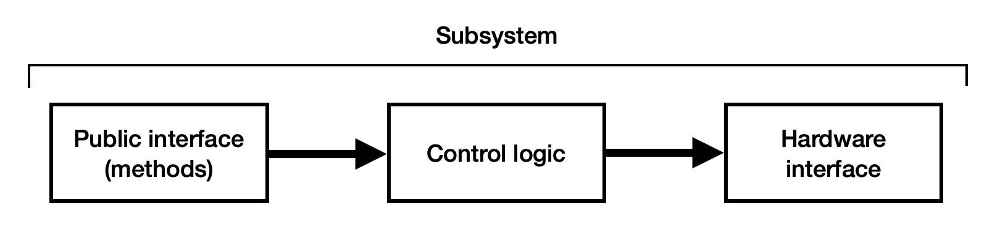

## What is an IO Layer?

Let's break down the concept of an "IO Layer." The official [AdvantageKit Docs](https://docs.advantagekit.org/data-flow/recording-inputs/io-interfaces) have a detailed explanation, but here's a quick summary to get you started.

Think about how a typical robot subsystem is built. It usually has three main parts:

1.  **Public Interface:** These are the commands you can give the subsystem from other parts of your code, like `getPose()` or `runHomingSequence()`.
2.  **Control Logic:** This is the "brains" of the subsystem. It takes your commands and figures out what needs to happen, like calculating the right speed for a motor.
3.  **Hardware Interface:** This is the code that talks directly to the physical hardware, like telling a specific motor to spin or reading a value from a sensor.

Here's what that looks like visually:



This traditional approach works, but it has a big drawback: the control logic and the hardware code are tightly linked. This makes it difficult to test your logic in a simulation (where there's no real hardware) or to switch from one type of motor to another without rewriting a lot of code.

This is where IO Layers come in. The solution is to separate the hardware-specific code from the main subsystem logic. An IO Layer acts as a "middleman," allowing you to create multiple versions of the hardware interface that can be swapped out easily.


# What does this look like in code?

When you build a new subsystem using this pattern, you first define a contract, or an "IO Interface," that describes all the things the hardware needs to do (e.g., "set motor voltage," "get encoder position").

Then, you create separate classes that fulfill this contract for different situations. For example, an elevator subsystem might have a single `ElevatorIO` interface. You could then have two different implementations:

*   `ElevatorIOTalonFX`: Code that implements the `ElevatorIO` interface using real TalonFX motor controllers.
*   `ElevatorIOSim`: Code that implements the same `ElevatorIO` interface, but with simulated motors for testing on your computer.

This way, your main `Elevator.java` subsystem file doesn't care which implementation is being used. It just talks to the `ElevatorIO` interface, allowing the same logic to work perfectly in simulation, on the real robot, or even with different motor types in the future.

Here's what that folder structure might look like:

```
elevator/
├── Elevator.java
├── ElevatorIO.java
├── ElevatorIOSim.java
└── ElevatorIOTalonFX.java
```

## Step 1: Define the IO Interface

The first step is to create the interface. This file defines the "contract" for all hardware implementations. It specifies what data needs to be read from the hardware and what actions can be sent to it.

Let's look at `ElevatorIO.java`:

```java
// ...
public interface ElevatorIO {
    @AutoLog
    class ElevatorIOInputs {
        public ElevatorIOData data =
                new ElevatorIOData(false, false, 0.0, 0.0, 0.0, 0.0, 0.0, 0.0, 0.0, 0.0, 0.0, 0.0);
    }

    record ElevatorIOData(
            boolean motorConnected,
            boolean followerConnected,
            double positionRad,
            // ... other data fields
            ) {}

    default void updateInputs(ElevatorIOInputs inputs) {}

    default void runPosition(double positionRad, double feedforward) {}

    // ... other control methods
}
```

There are two key parts here:

1.  **`ElevatorIOInputs`**: This inner class, annotated with `@AutoLog`, holds all the data we want to *read from* the hardware. AdvantageKit will automatically log this data. We use a `record` (`ElevatorIOData`) to store the values immutably. This includes things like motor position, velocity, voltage, and temperature.
2.  **Methods (`runPosition`, `runVolts`, etc.)**: These are the commands the subsystem can send *to* the hardware. By defining them in the interface, we guarantee that any class implementing `ElevatorIO` will have these methods.

## Step 2: Create the Simulation Implementation

Next, we create a simulated version of our hardware. This class implements the `ElevatorIO` interface but doesn't talk to any real motors. Instead, it uses a physics model to predict how the elevator would behave.

In `ElevatorIOSim.java`:

```java
public class ElevatorIOSim implements ElevatorIO {
    // ... physics constants and simulation state variables
    private Vector<N2> simState; // Stores simulated position and velocity
    private final PIDController controller = new PIDController(0.0, 0.0, 0.0);

    @Override
    public void updateInputs(ElevatorIOInputs inputs) {
        // ... update physics simulation
        update(Constants.loopPeriodSecs);

        // Populate the inputs object with simulated data
        inputs.data =
                new ElevatorIOData(
                        true,
                        true,
                        simState.get(0) / Elevator.drumRadius, // position
                        simState.get(1) / Elevator.drumRadius, // velocity
                        appliedVolts,
                        // ... other simulated values
                        );
    }

    @Override
    public void runPosition(double positionRad, double feedforward) {
        closedLoop = true;
        controller.setSetpoint(positionRad);
        this.feedforward = feedforward;
    }
    // ... other implemented methods
}
```

*   **`updateInputs()`**: Instead of reading from a sensor, this method advances the physics simulation (`NumericalIntegration.rkdp`). It then populates the `inputs.data` object with the new simulated position, velocity, etc.
*   **`runPosition()`**: This method doesn't command a real motor. It simply sets the setpoint for the simulated PID controller, which is then used in the `updateInputs` physics loop.

## Step 3: Create the Real Hardware Implementation

Now we create the class for the real robot. This class also implements `ElevatorIO`, but its methods call the actual hardware vendor libraries (like CTRE or REV).

Here is what a simplified `ElevatorIOTalonFX.java` might look like:

```java
// This is a hypothetical example
public class ElevatorIOTalonFX implements ElevatorIO {
        private final TalonFX motor;
        private final TalonFX follower;

        public ElevatorIOTalonFX() {
                motor = new TalonFX(Constants.elevatorMotorID);
                follower = new TalonFX(Constants.elevatorFollowerID);
                // ... configuration
        }

        @Override
        public void updateInputs(ElevatorIOInputs inputs) {
                inputs.data = new ElevatorIOData(
                        motor.getDeviceID() != 0,
                        follower.getDeviceID() != 0,
                        Units.rotationsToRadians(motor.getPosition().getValue()),
                        Units.rotationsToRadians(motor.getVelocity().getValue()),
                        motor.getMotorVoltage().getValue(),
                        motor.getTorqueCurrent().getValue(),
                        // ... and so on for all fields
                );
        }

        @Override
        public void runPosition(double positionRad, double feedforward) {
                motor.setControl(
                        new PositionVoltage(
                                Units.radiansToRotations(positionRad)
                        ).withFeedForward(feedforward)
                );
        }
        // ... other implemented methods
}
```

Notice the difference:
*   **`updateInputs()`**: This method calls functions like `motor.getPosition()` and `motor.getMotorVoltage()` to get live data from the motor controller and populates the `inputs.data` object.
*   **`runPosition()`**: This method calls `motor.setControl()` to command the physical TalonFX motor to move to a specific position.

## Step 4: Tying It All Together

The final piece is to select which implementation to use at runtime. This is typically done in `RobotContainer.java`.

```java
// In RobotContainer.java
// ...
private final Elevator elevator;

public RobotContainer() {
        // ...
        if (Robot.isReal()) {
                elevator = new Elevator(new ElevatorIOTalonFX());
        } else {
                elevator = new Elevator(new ElevatorIOSim());
        }
        // ...
}
```

The `Elevator` subsystem itself is constructed with an `ElevatorIO` object. It has no idea whether it's the real or simulated version.

```java
// In Elevator.java
public class Elevator extends SubsystemBase {
        private final ElevatorIO io;
        private final ElevatorIOInputsAutoLogged inputs = new ElevatorIOInputsAutoLogged();

        public Elevator(ElevatorIO io) {
                this.io = io;
        }

        public void setHeight(double heightMeters) {
                io.runPosition(heightMeters / drumRadius, feedforward);
        }

        @Override
        public void periodic() {
                io.updateInputs(inputs);
                Logger.processInputs("Elevator", inputs);
        }
}
```

The `Elevator` class just calls `io.updateInputs()` and `io.runPosition()`. Because both `ElevatorIOSim` and `ElevatorIOTalonFX` implement the `ElevatorIO` interface, the same subsystem logic works perfectly for both simulation and the real world.
